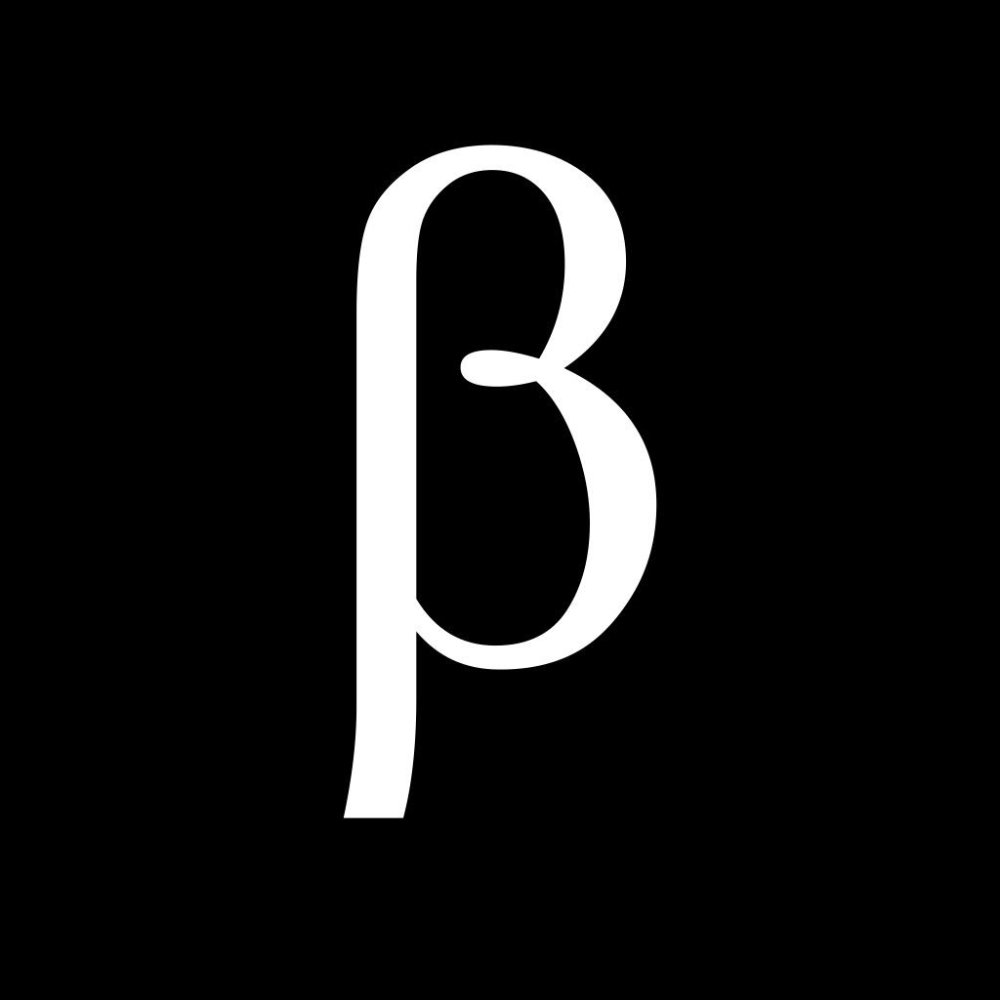

<div align="center">



# MacMarkDown

**一款用纯 Swift 与 SwiftUI 从零构建的原生 macOS Markdown 编辑器。**

<!-- 语言切换：请与 README.md 保持同步 -->
[English](README.md) · **简体中文**


</div>

macOS 26 与 Swift 6.4 为 Apple 的开发生态开启了新纪元：SwiftUI、Observation、
TextKit 2 与 Swift 并发已经成熟到足以承载一个完整的写作工具。**MacMarkDown**
正是为这个新纪元而写——一款原生 macOS 文档应用，没有跨平台运行时，没有
Interface Builder 文件，也没有第三方解析引擎，端到端只有 Swift、SwiftUI 与
Apple 原生框架。

它把自研的 TextKit 2 编辑器与实时原生预览并排放在一起，提供完整的 Markdown
能力，以及专业写作流程所需的导出与自动化功能——全部装在一个快速、本地优先的
应用里，无需账号，无需联网。

---

## 目录

- [为什么选择 MacMarkDown](#为什么选择-macmarkdown)
  - [数字一览](#数字一览)
- [功能特性](#功能特性)
  - [写作与编辑](#写作与编辑)
  - [实时预览](#实时预览)
  - [Markdown 支持](#markdown-支持)
  - [导出与自动化](#导出与自动化)
  - [个性化](#个性化)
- [环境要求](#环境要求)
- [快速开始](#快速开始)
  - [在 Xcode 中打开](#在-xcode-中打开)
  - [命令行构建](#命令行构建)
  - [重新生成工程](#重新生成工程)
  - [项目脚本](#项目脚本)
- [使用指南](#使用指南)
  - [键盘快捷键](#键盘快捷键)
  - [命令行工具](#命令行工具)
  - [URL Scheme](#url-scheme)
  - [AppleScript](#applescript)
  - [插件](#插件)
- [架构](#架构)
- [文档](#文档)
- [本地化](#本地化)
- [参与贡献](#参与贡献)
- [许可证](#许可证)
- [致谢](#致谢)

---

## 为什么选择 MacMarkDown

- **原生到底。** 自研的 TextKit 2 编辑器与原生预览表面；WebKit 只在真正需要
  它的地方出现——表格与 TeX 数学公式。
- **面对真实文档依然飞快。** 基于视口的布局只渲染可见区域，即使面对超长、
  以中日韩文字为主的文档，滚动依然顺滑。
- **安全由编译器保证。** 所有 target 均开启 Swift 6.4 严格并发：编辑器状态
  隔离在主 actor 上，解析结果是不可变的 `Sendable` 值类型。
- **本地优先，隐私无忧。** 解析、高亮、数学公式与图表引擎全部随应用分发。
  没有账号，没有网络请求，没有遥测。
- **地道的 macOS 公民。** 多窗口文档、自动保存、访达集成、服务菜单、
  Touch Bar、AppleScript、URL Scheme 与命令行工具。
- **随你塑造。** 15 套编辑器主题、6 套预览样式、可选代码高亮调色板、HTML
  导出模板，以及用户可自行安装的 `.style` 主题。

### 数字一览

| 指标 | 数值 |
|------|------|
| 语言 | 100% Swift——应用与框架代码共 16,851 行 |
| 测试 | 414 个单元测试（6,316 行），分布在 29 个测试套件 |
| Target | 4 个——应用、框架、CLI 与测试包 |
| Markdown 引擎 | Apple swift-markdown + Yams，之上是原生 `MarkdownElement` 树 |
| 主题 | 15 套编辑器主题 · 6 套预览样式 |
| 本地化 | 21 种语言，含简体与繁体中文 |
| 第三方 Swift 包 | 2 个——swift-markdown 与 Yams |

---

## 功能特性

### 写作与编辑

- 自研 **TextKit 2 编辑器**：基于视口的布局、精确的光标与选区几何、自动换行
  与“越过末尾滚动”。
- **格式化命令**覆盖整套 Markdown 工具箱——标题、强调、列表、引用、链接、
  图片、代码与分隔线——可从“格式”菜单、工具栏或 Touch Bar 触发。
- **智能编辑**，每项行为都可单独配置：匹配字符自动补全（ASCII 与中日韩标点）、
  回车自动续写列表/引用、有序列表自动编号、Tab 转空格、Smart Home 等。
- **查找与替换**：区分大小写、循环查找、全部替换。
- **拼写检查**：使用系统词典与 macOS 标准建议菜单。
- **字数统计**：词数、字符数或不含空格的字符数。
- **完整键盘编辑**：输入、命令、查找替换与拖放全部支持撤销/重做。
- **输入法组合输入**：完整支持中文、日文、韩文输入。
- 行号栏、不可见字符显示、朗读，以及服务菜单集成。

### 实时预览

- **原生预览表面**与编辑器共用同一套 TextKit 2 引擎：文本可选中、支持 ⌘A 与
  带格式复制。
- **同步滚动**：默认编辑器 → 预览单向同步，可选双向；由密集的块级与列表项
  锚点驱动。
- **表格与 TeX 公式**交由 WebKit 按真实 CSS 排版（公式由 MathJax 渲染），
  其余内容全部原生渲染。
- **预览缩放**以编辑器基础字号为基准，并支持跟随编辑器 / 系统 / 自定义字体
  策略。
- **front matter、任务列表、目录、脚注与代码高亮**在预览与导出的 HTML 中
  一致呈现。

### Markdown 支持

标准 Markdown 之外，还提供大量可在“设置 → Markdown / HTML”中逐项开关的扩展：

| 功能 | 默认 | 功能 | 默认 |
|------|:----:|------|:----:|
| 表格 | 开 | 下划线 `_text_` | 关 |
| 围栏代码块 | 开 | 高亮 `==text==` | 关 |
| 删除线 | 开 | 上标 `^text^` | 关 |
| 裸 URL 自动链接 | 开 | 引号 `"text"` → `<q>` | 关 |
| 脚注 | 开 | TeX 数学公式 `\[…\]`、`$$…$$` | 关 |
| 任务列表 | 开 | 行内公式 `$…$` | 关 |
| 词内强调 | 开 | 目录 `[toc]` | 关 |
| SmartyPants 排版 | 开 | 硬换行 | 关 |
| YAML front matter | 开 | 代码块行号 | 关 |

### 导出与自动化

- **导出 HTML**：使用内置模板与样式表，可选内联样式与语法高亮。
- **导出 PDF**：走 macOS 打印管线，另有**打印**与**页面设置**。
- **复制 HTML** 到剪贴板。
- **AppleScript**：读写文档的 `text` 属性，读取渲染后的 `html` 属性。
- **URL Scheme**：`x-macmarkdown://open?url=…`，供其他应用与脚本打开文件。
- **命令行工具**：`macmarkdown [files…]`，也支持管道输入。
- **插件**：`.macmarkdown-plugin` 包可向“插件”菜单添加自己的菜单项。

### 个性化

- 15 套编辑器主题（`.style`）与 6 套预览样式（`.css`），运行时切换，并支持
  用户自行安装主题。
- 围栏代码块可选择代码高亮调色板。
- HTML 导出模板可选。
- 五个设置面板——**通用**、**Markdown**、**编辑器**、**HTML**、**终端**——
  每个滑块都带一键恢复默认值按钮。
- 编辑器可置于左侧或右侧；可调内边距、行距、最大文本宽度与 1:1 / 1:3 / 3:1
  分栏比例。

---

## 环境要求

| 项目 | 最低版本 | 说明 |
|------|----------|------|
| macOS | 26.0 | 基于 macOS 27 SDK 构建与测试 |
| Xcode | 26.0 | 推荐 Xcode 27 |
| Swift | 6.4 | 所有 target 均开启严格并发 |
| XcodeGen | 2.44+ | 仅在需要从 `project.yml` 重新生成工程时使用 |

---

## 快速开始

```bash
git clone https://github.com/xAIat/MacMarkDown.git
cd MacMarkDown
```

### 在 Xcode 中打开

```bash
open MacMarkDown.xcodeproj
```

> 请打开 **`MacMarkDown.xcodeproj`**，而不是仓库文件夹。工程中包含全部四个
> target，直接打开文件夹无法构建出可运行的应用。

然后按 **⌘R** 运行。首次打开时 Xcode 会自动解析 Swift Package 依赖
（`swift-markdown`、`Yams`）。

### 命令行构建

```bash
# Debug 构建
xcodebuild -project MacMarkDown.xcodeproj -scheme MacMarkDown \
           -configuration Debug build

# Release 构建
xcodebuild -project MacMarkDown.xcodeproj -scheme MacMarkDown \
           -configuration Release build
```

### 重新生成工程

`project.yml` 是 Xcode 工程的唯一事实来源。新增或删除源文件后：

```bash
brew install xcodegen
xcodegen generate
```

### 项目脚本

```bash
./scripts/build.sh              # 构建验证（debug 或 release）
./scripts/test.sh               # 运行 414 个单元测试
./scripts/test.sh --coverage    # 附带代码覆盖率
./scripts/lint.sh               # 严格并发与风格检查
```

---

## 使用指南

### 键盘快捷键

| 操作 | 快捷键 | 操作 | 快捷键 |
|------|--------|------|--------|
| 加粗 | ⌘B | 正文段落 | ⌘0 |
| 斜体 | ⌘I | 标题 1–6 | ⌘1 – ⌘6 |
| 行内代码 | ⌘K | 无序列表 | ⌃⌘U |
| 删除线 | ⌃⌘S | 有序列表 | ⌃⌘O |
| 下划线 | ⌘U | 引用块 | ⌃⌘B |
| 高亮 | ⇧⌘H | 增加 / 减少缩进 | ⌘] / ⌘[ |
| 注释 | ⌥⌘/ | 新段落 | ⌘Return |
| 查找 | ⌘F | 立即渲染 | ⌘R |
| 导出 HTML | ⌘E | 导出 PDF | ⇧⌘E |
| 复制 HTML | ⌥⌘C | 打印 | ⌘P |
| 显示/隐藏工具栏 | ⌥⌘T | 页面设置 | ⇧⌘P |

### 命令行工具

在 **设置 → 终端 → 安装** 中把 `macmarkdown` 安装到 `/usr/local/bin`，然后：

```bash
macmarkdown notes.md            # 打开一个文件
macmarkdown a.md b.md           # 打开多个文件
cat notes.md | macmarkdown      # 把管道输入作为新文档打开
macmarkdown --help
```

### URL Scheme

```text
x-macmarkdown://open?url=file:///Users/you/notes.md
```

### AppleScript

MacMarkDown 内置脚本定义（`Resources/MacMarkDown.sdef`），包含标准套件与一个
文档类：

```applescript
tell application "MacMarkDown"
    set theText of document 1 to "# Hello"
    get html of document 1
end tell
```

### 插件

把 `.macmarkdown-plugin` 包放入
`~/Library/Application Support/MacMarkDown/PlugIns`。包的主类实现 `name` 与
`run(_:)`，每个插件会在**插件**菜单中获得一个菜单项。增删插件后选择
**插件 → 重新加载插件**。

---

## 架构

MacMarkDown 是一个由 XcodeGen 生成的单一 Xcode 工程：极薄的应用外壳，包裹着
承载全部核心逻辑的框架。

| Target | 产物 | 源码 |
|--------|------|------|
| `MacMarkDown` | `MacMarkDown.app` | `MacMarkDown/Application` |
| `MacMarkDownKit` | `MacMarkDownKit.framework` | `MacMarkDown/`（核心） |
| `MacMarkDownCLI` | `macmarkdown-cli` | `CLI/` |
| `MacMarkDownTests` | 单元测试包 | `MacMarkDown/Tests/` |

| 依赖 | 用途 |
|------|------|
| [swift-markdown](https://github.com/apple/swift-markdown) | CommonMark 解析与 AST 基础 |
| [Yams](https://github.com/jpsim/Yams) | YAML front matter |
| MathJax（内置） | 预览与导出 HTML 中的 TeX → SVG |
| Mermaid（内置） | 导出 HTML 中的图表 |
| Viz.js / Graphviz（内置） | 导出 HTML 中的图表 |
| Sparkle（占位配置） | 更新源配置，可选启用 |

```text
MacMarkDown/
├── Application/        # @main 外壳、App 代理、菜单
├── Document/           # 文档模型、会话、front matter、脚本桥接
├── Markdown/           # 解析器、AST、解析选项、锚点
├── Services/           # Editor、Preview、Export、ScrollSync、PlugIn
├── Stores/             # 可观察的偏好设置
├── Theme/              # 编辑器主题、预览样式、代码调色板
├── Tools/              # 常量、资源加载、工具
├── UI/                 # 共享与 macOS 平台 SwiftUI 视图、TextKit 2 编辑器
├── Resources/          # Styles、Themes、Templates、内置 Web 引擎
└── Tests/              # 414 个单元测试
CLI/                    # macmarkdown 命令行工具
Resources/              # 应用图标、字符串目录、帮助文档、脚本定义
docs/                   # 中英双语技术文档
scripts/                # build.sh · test.sh · lint.sh
```

关键设计决策记录在 ADR 与 RFC 中，见[文档](#文档)。

---

## 文档

包括本 README 在内的所有文档均提供英文与中文两个版本，文件顶部与底部的语言
切换链接用于在两个翻译之间跳转：

| 文档 | English | 中文 |
|------|---------|------|
| 文档索引 | [docs/index.md](docs/index.md) | [docs/index.zh.md](docs/index.zh.md) |
| 产品概述 | [overview.md](docs/business/overview.md) | [overview.zh.md](docs/business/overview.zh.md) |
| 开发指南 | [guide.md](docs/guide/guide.md) | [guide.zh.md](docs/guide/guide.zh.md) |
| 贡献指南 | [contributing.md](docs/guide/contributing.md) | [contributing.zh.md](docs/guide/contributing.zh.md) |
| 核心架构（RFC-001） | [rfc-001](docs/design/rfc-001-core-architecture.md) | [rfc-001](docs/design/rfc-001-core-architecture.zh.md) |
| 渲染管线（RFC-002） | [rfc-002](docs/design/rfc-002-rendering-pipeline.md) | [rfc-002](docs/design/rfc-002-rendering-pipeline.zh.md) |
| 编辑器集成（RFC-003） | [rfc-003](docs/design/rfc-003-editor-integration.md) | [rfc-003](docs/design/rfc-003-editor-integration.zh.md) |
| 纯 SwiftUI（ADR-001） | [adr-001](docs/architecture/adr-001-pure-swiftui.md) | [adr-001](docs/architecture/adr-001-pure-swiftui.zh.md) |
| Swift Markdown 解析器（ADR-002） | [adr-002](docs/architecture/adr-002-swift-markdown.md) | [adr-002](docs/architecture/adr-002-swift-markdown.zh.md) |
| 原生预览（ADR-003） | [adr-003](docs/architecture/adr-003-native-preview.md) | [adr-003](docs/architecture/adr-003-native-preview.zh.md) |
| 编辑器主题（ADR-004） | [adr-004](docs/architecture/adr-004-editor-themes.md) | [adr-004](docs/architecture/adr-004-editor-themes.zh.md) |
| Swift 26 合规审计 | [audit](docs/reference/apple-swift-26-compliance-audit.md) | [audit](docs/reference/apple-swift-26-compliance-audit.zh.md) |
| 现场事故复盘 | [postmortem](docs/postmortems/2026-09-field-incidents.md) | [postmortem](docs/postmortems/2026-09-field-incidents.zh.md) |

应用内还内置了一份可交互的用户手册，它本身就是渲染效果的测试页：
[Resources/help.md](Resources/help.md)（英文）。

---

## 本地化

界面已本地化为 21 种语言：

阿拉伯语、捷克语、丹麦语、德语、西班牙语、爱沙尼亚语、芬兰语、法语、冰岛语、
意大利语、日语、韩语、挪威语（博克马尔）、荷兰语、葡萄牙语（巴西）、俄语、
斯洛伐克语、瑞典语、土耳其语、简体中文与繁体中文。

翻译文件位于 [`Resources/Localizable.xcstrings`](Resources/Localizable.xcstrings)，
使用 Xcode 的 String Catalog 编辑器维护。

---

## 参与贡献

欢迎各种形式的贡献——代码、文档与翻译皆可。请先阅读
[贡献指南](docs/guide/contributing.zh.md)，然后：

```bash
git clone https://github.com/xAIat/MacMarkDown.git
cd MacMarkDown
./scripts/test.sh && ./scripts/lint.sh
```

- 保持 Swift 6.4 严格并发零警告；lint 脚本会在出现新警告时失败。
- `project.yml` 是唯一事实来源——新增文件后请运行 `xcodegen generate`。
- 文档是双语的：请同时更新 `*.md` 与 `*.zh.md`。

---

## 许可证

MacMarkDown 基于 [MIT 许可证](LICENSE)发布。

---

## 致谢

MacMarkDown 建立在优秀的开源工作之上：

- [swift-markdown](https://github.com/apple/swift-markdown) 与 Swift 社区
  提供的解析基础。
- [Yams](https://github.com/jpsim/Yams) 提供的 YAML front matter 支持。
- [MathJax](https://www.mathjax.org)、[Mermaid](https://mermaid.js.org) 与
  [Viz.js](https://github.com/mdaines/viz.js) 提供的内置渲染引擎。

完整许可信息见 [THIRD_PARTY_NOTICES.md](THIRD_PARTY_NOTICES.md)。

---

<div align="center">

[English](README.md) · **简体中文**

为 macOS 上 Swift 与 SwiftUI 的新纪元而作。

</div>
