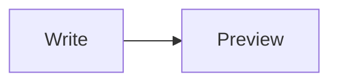
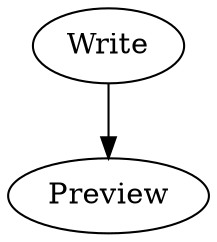

# MacMarkDown

**MacMarkDown** is a native Markdown editor for macOS, written from scratch in pure Swift and SwiftUI.

macOS 26 and Swift 6.4 opened a new era for Apple's developer frameworks: SwiftUI, the Observation framework, TextKit 2 and Swift concurrency became mature enough to carry a complete writing tool, so MacMarkDown was written from scratch in pure Swift and SwiftUI.

MacMarkDown puts a TextKit 2 editor and a live preview side by side: you write Markdown in one pane and watch it become a formatted document in the other. Parsing is done with Apple's [swift-markdown](https://github.com/apple/swift-markdown) package, YAML front matter is parsed with Yams, and the rendering engines for math and diagrams are bundled with the app. Everything runs locally; no account and no network connection are required.

## At a Glance

- Split editing with a live preview and optional synchronized scrolling.
- Standard Markdown plus optional extensions: tables, fenced code blocks, footnotes, task lists, strikethrough, underline, highlight, superscript and more.
- YAML front matter, TeX math (MathJax), Mermaid and Graphviz diagrams.
- Native syntax highlighting in the editor and in code blocks, with selectable palettes.
- 15 `.style` editor themes and 6 CSS preview stylesheets.
- Export to HTML and PDF, copy HTML, print.
- AppleScript support, the `x-macmarkdown://` URL scheme, a `macmarkdown` command-line tool and plug-ins.
- Localized in 21 languages.

## Contents

- [The Basics](#the-basics)
- [Extended Syntax](#extended-syntax)
- [Editing Aids](#editing-aids)
- [Preferences](#preferences)
  - [General](#general-pane)
  - [Markdown](#markdown-pane)
  - [Editor](#editor-pane)
  - [HTML](#html-pane)
  - [Terminal](#terminal-pane)
- [Scripting, Plug-Ins and the Command Line](#integration)
- [Exporting and Printing](#exporting)

## <a name="the-basics"></a>The Basics

**Markdown** is a plain-text formatting syntax created by John Gruber. It is designed to be readable as ordinary text and to convert cleanly to HTML. MacMarkDown supports all of standard Markdown, plus the optional extensions you enable in the [Markdown pane](#markdown-pane) of the settings window.

If you already know Markdown, skip ahead to [Extended Syntax](#extended-syntax).

### Line Breaks

To force a line break, end a line with two spaces and press Return. The two spaces are invisible, which is why this rule surprises people.

* This two-line bullet
won't break

* This two-line bullet  
will break

Here is the source; the second bullet's first line ends with two spaces:

```
* This two-line bullet
won't break

* This two-line bullet  
will break
```

### Strong and Emphasis

**Strong**: `**Strong**` or `__Strong__` (⌘B)  
*Emphasis*: `*Emphasis*` or `_Emphasis_`[^emphasize] (⌘I)

### Headings (Like This One)

Setext style, with an underline:

```
Heading 1
=========

Heading 2
---------
```

ATX style, with `#` marks:

```
# Heading 1
## Heading 2
### Heading 3
#### Heading 4
##### Heading 5
###### Heading 6
```

Use the Format menu or ⌘1 – ⌘6 to turn the current paragraph into a heading; ⌘0 turns it back into a paragraph.

### Links and Email

Wrap an address or URL in angle brackets and it becomes clickable: <you@example.com> and <https://example.com>

To link a piece of text, put the target after it:

```
[Example Website](https://example.com "Title")
```

The title is optional. For long URLs, or when you want all targets collected in one place, use a reference:

```
Make [a link][arbitrary_id] anywhere in the text, then define the target on its own
line elsewhere in the document:

[arbitrary_id]: https://example.com "Title"
```

If the link text itself makes a good identifier, the second set of brackets can be left empty: `[like this][]`, with `[like this]: https://example.com` as the definition.

### Images

Inline images use the same syntax as links, with a leading `!`:

```

```

Reference-style images work too:

```
![Alt image text][image-id]

[image-id]: path/or/url/to.jpg "Optional Title"
```

Relative paths resolve against the document's folder. For an unsaved document, they resolve against the default directory set in the [HTML pane](#html-pane).

### Lists

* Start each unordered item with `*`
* A `-` or `+` works too
	* Indent a level to nest a list
		1. Ordered lists are supported
		2. Start each item with a number, a period and a space: `1. `
		42. The number you type does not matter — the preview numbers the items in order
		1. So you can start every ordered item with `1.` and let MacMarkDown sort it out

Here is the source:

```
* Start each unordered item with `*`
* A `-` or `+` works too
	* Indent a level to nest a list
		1. Ordered lists are supported
		2. Start each item with a number, a period and a space: `1. `
		42. The number you type does not matter
		1. So you can start every ordered item with `1.`
```

Leave a blank line before the first item of a list. In the editor, ordered lists renumber automatically as you edit, and the Editor pane's **Unordered List Marker** setting chooses the `*`, `-` or `+` used by the formatting commands.

### Block Quotes

> Angle brackets `>` mark a block quote.  
> Every line should start with a `>` when paragraphs are involved.
> > Block quotes nest.
> > > Multiple levels are fine.
>
> Most Markdown syntax works inside a block quote, including:
>
> * Lists
> * **Emphasis**
> * And so on.

Here is the source:

```
> Angle brackets `>` mark a block quote.  
> Every line should start with a `>` when paragraphs are involved.
> > Block quotes nest.
> > > Multiple levels are fine.
>
> Most Markdown syntax works inside a block quote.
```

### Inline Code

Wrap a word in backticks to keep it literal: `` `Inline code` ``.

If the code itself contains backticks, use a longer run of backticks as the delimiter, with a space on each side:

```
`Inline code`

``Code with `backticks` ``
```

### Block Code

Indent a block by at least four spaces or one tab and it stays literal:

```
	print('This is a code block')
	print('The block must be preceded by a blank line')
	print('Then indent at least 4 spaces or 1 tab')
		print('Nesting does nothing — the code is shown literally')
```

MacMarkDown also supports [fenced code blocks](#fenced-code-block), described below.

### Horizontal Rules

Three asterisks `***` or three dashes `---` on a line of their own produce a horizontal rule:

---

## <a name="extended-syntax"></a>Extended Syntax

For historical reasons, Markdown's optional features are called extensions. Each can be turned on or off with a toggle in the [Markdown pane](#markdown-pane), except where noted otherwise.

### Tables

This is a table:

First Header  | Second Header
------------- | -------------
Content Cell  | Content Cell
Content Cell  | Content Cell

You can align the columns with colons:

| Left Aligned  | Center Aligned  | Right Aligned |
|:------------- |:---------------:| -------------:|
| col 3 is      | some wordy text |         $1600 |
| col 2 is      | centered        |           $12 |
| zebra stripes | are neat        |            $1 |

The outermost pipes (`|`) are decorative and can be omitted, and the spaces do not matter. Alignment is controlled solely by the `:` marks.

### <a name="fenced-code-block"></a>Fenced Code Blocks

Instead of indenting a code block, fence it with three or more backticks:

````
```swift
print("Hello, world!")
```
````

Waves (`~`) work the same way:

```
~~~
print("Hello, world!")
~~~
```

Add a language identifier after the opening fence. The identifier selects the grammar for highlighting when **Syntax Highlighting** is enabled in the [HTML pane](#html-pane); without one, the block is still styled, but not highlighted:

````
```python
def greet(name):
    return f"Hello, {name}!"
```
````

The HTML pane also controls code blocks' **Line Numbers**, the **Highlighting Theme** palette and the **Code Block Accessory** — a small label that can show the language name, your own text, or nothing at all. Code is highlighted natively, so no internet connection is involved.

### Inline Formatting

The following inline markups are optional and controlled in the [Markdown pane](#markdown-pane):

| Option              | Markup         | Result if enabled    |
|---------------------|----------------|----------------------|
| Intra-word emphasis | `A*maz*ing`    | A<em>maz</em>ing     |
| Strikethrough       | `~~Much wow~~` | <del>Much wow</del>  |
| Underline [^under]  | `_So doge_`    | <u>So doge</u>       |
| Blockquote [^quote] | `"Such editor"`| <q>Such editor</q>   |
| Highlight           | `==So good==`  | <mark>So good</mark> |
| Superscript         | `hoge^(fuga)`  | hoge<sup>fuga</sup>  |
| Autolink            | `https://example.com` | a clickable link |

### Footnotes

Mark a reference with `[^label]` and define it anywhere with `[^label]:`:

```
MacMarkDown renders footnotes.[^1]

[^1]: The note text goes here.
```

Labels do not have to be numbers: `[^note]` works as well as `[^1]`. Footnotes render numbered, in the order they are referenced, no matter where the definitions sit — you can keep a note next to its reference or collect them all at the bottom of the file.

### Task Lists

- [x] Render checkbox list syntax
	- [x] Nested items work
	- [x] Ordered and unordered lists both work
- [ ] Change the state by editing the source

The preview draws checkboxes but does not let you click them; change `[x]` to `[ ]` in the text. The **Task List** toggle lives in the [HTML pane](#html-pane).

### Front Matter

If a document starts with a block fenced by `---`, MacMarkDown treats it as YAML front matter:

```
---
title: "Release notes"
date: 2026-10-01
tags:
  - markdown
  - writing
---
```

The block must be the very first thing in the file. The YAML is parsed with Yams, so nested mappings and lists are supported, and it appears in the preview as a nested table. Use **Detect Front Matter** in the [HTML pane](#html-pane) to turn detection on or off.

### Math

MacMarkDown renders TeX-like math with MathJax. Display math uses `$$…$$` or `\[…\]`, inline math uses `\(…\)` and — when **Inline Math ($…$)** is enabled — `$…$`:

```
The quadratic formula:

$$
x = \frac{-b \pm \sqrt{b^2 - 4ac}}{2a}
$$

Einstein's relation \(E = mc^2\) fits inline, and with the inline-dollar toggle
on, so does $a^2 + b^2 = c^2$.
```

Both toggles, **TeX Math (MathJax)** and **Inline Math ($…$)**, live in the [HTML pane](#html-pane). MathJax is bundled, so formulas render offline.

### Diagrams

With **Mermaid Diagrams** enabled, a fenced block whose language is `mermaid` becomes a diagram:

````

````

With **Graphviz Diagrams** enabled, `dot` and related language IDs are drawn by Graphviz:

````

````

The Mermaid and Graphviz engines are bundled with the app — Graphviz runs on Viz.js — and render locally.

## <a name="editing-aids"></a>Editing Aids

MacMarkDown offers more than a text area. Most of these behaviors can be tuned in the [Editor pane](#editor-pane).

### Formatting Commands

The Format menu, the toolbar and the Touch Bar all apply Markdown formatting to the selection:

| Command          | Shortcut |
|------------------|----------|
| Strong           | ⌘B       |
| Emphasize        | ⌘I       |
| Inline Code      | ⌘K       |
| Strikethrough    | ⌃⌘S      |
| Underline        | ⌘U       |
| Highlight        | ⇧⌘H      |
| Comment          | ⌥⌘/      |
| Link / Image     | Format menu |
| Paragraph        | ⌘0       |
| Heading 1 – 6    | ⌘1 – ⌘6  |
| Unordered List   | ⌃⌘U      |
| Ordered List     | ⌃⌘O      |
| Blockquote       | ⌃⌘B      |
| Indent / Unindent| ⌘] / ⌘[  |
| New Paragraph     | ⌘Return  |

### Smart Editing

- **Complete Matching Characters** closes `(`, `[`, quotes and emphasis markers for you as you type.
- **Insert Prefix in Block** continues `* `, `1. ` and `> ` prefixes when you press Return inside a list or quote; ordered lists renumber automatically.
- **Convert Tabs to Spaces** inserts spaces when you press Tab.
- **Smart Home** moves the caret to the first non-whitespace character of the line, then to the very beginning.
- **Scrolls Past End** lets the view scroll past the last line.
- **Ensure Newline at End of File** keeps the final line terminated.

### Find and Replace

Choose Edit > Find (⌘F) to show the find bar. It can search case-sensitively and replace matches one at a time or all at once.

### Spell Checking

Turn on **Spell Checking** in the [Editor pane](#editor-pane) for the familiar dotted underlines and the standard macOS suggestions menu.

### Word Count

Turn on **Show Word Count** and choose **Words**, **Characters** or **Characters (no spaces)** in the [Editor pane](#editor-pane).

### Sync Scrolling

With **Sync Scrolling** on, moving through the editor keeps the preview at the matching position. **Bidirectional Sync** additionally lets the preview drive the editor. Both are in the [Editor pane](#editor-pane).

### Touch Bar

On a Mac with a Touch Bar, MacMarkDown puts its formatting commands there: strong, emphasis, inline code, strikethrough, links and images, lists, blockquote, indent and unindent, editor and preview toggles, and Copy HTML.

## <a name="preferences"></a>Preferences

Open MacMarkDown > Settings… (⌘,) to configure the app. Settings has five panes.

### <a name="general-pane"></a>General

**Launch**

- **Suppress Untitled Document on Launch** — when on, launching MacMarkDown does not open an empty document.
- **Create File for Link Targets** — when you follow a link to a local file that does not exist yet, create it.

**Updates**

- **Include Pre-Releases** — include pre-release builds when checking for updates.

### <a name="markdown-pane"></a>Markdown

**Rendering**

- **Manual Render** — when on, the preview updates only when you choose Render Markdown (⌘R). When off (the default), it follows your typing.

**Extensions** — each toggle controls one piece of optional syntax:

| Toggle              | What it enables                          | Default |
|---------------------|------------------------------------------|---------|
| Intra-word Emphasis | `A*maz*ing`                              | on      |
| Tables              | Pipe tables like the one above           | on      |
| Fenced Code Blocks  | Backtick- or tilde-fenced code blocks    | on      |
| Autolink            | Bare URLs become links                   | on      |
| Strikethrough       | `~~text~~`                               | on      |
| Underline           | `_text_` becomes underlined              | off     |
| Highlight           | `==text==`                               | off     |
| Superscript         | `x^(2)`                                  | off     |
| Footnotes           | `[^label]` references and definitions    | on      |
| Blockquote          | Matched `"quotes"` become `<q>` elements | off     |
| SmartyPants         | Curly quotes, dashes and ellipses        | on      |

**Blockquote** here is not the `>` block quote syntax; it is the inline conversion of straight quotes to `<q>` tags. It works alongside **SmartyPants**, which styles the quotes that remain. If both are on, a matched pair becomes a `<q>` element first.

### <a name="editor-pane"></a>Editor

**Font**

- **Font** — the editor's base font; the field defaults to System (SF Mono). Use **Choose…** to open the font panel, or the reset button to return to the system monospaced face.
- **Size** — 9 to 32 points; the default is 15.
- If the chosen font is not a CJK monospaced font, the pane reminds you that Chinese text lines up with the Latin grid only in a font such as Sarasa Mono SC.

**Theme**

- **Editor Theme** — the editor's syntax-highlighting palette. Six palettes are built in, and 15 more ship as `.style` theme files, for plenty of variety.

**Layout**

- **Width Limited** with **Max Width** (400–1400 points; default 800) keeps lines at a comfortable measure.
- **Editor on Right** swaps the editor and preview sides.
- **Line Spacing** (1.0–2.5; default 1.4), **Horizontal Inset** and **Vertical Inset** (0–80 points each; default 16) control the editor's typography and padding.

**Behavior**

- **Show Word Count** and **Word Count Type** (Words, Characters, Characters (no spaces)).
- **Sync Scrolling** and **Bidirectional Sync**.
- **Smart Home**, **Convert Tabs to Spaces**, **Insert Prefix in Block** and **Complete Matching Characters**.
- **Unordered List Marker** — `*`, `-` or `+`.
- **Scrolls Past End**, **Ensure Newline at End of File** and **Auto Save Changes** — the last one writes edits back to file-bound documents shortly after you stop typing.
- **Spell Checking**, **Show Line Numbers** and **Show Invisible Characters**.

### <a name="html-pane"></a>HTML

**Preview Style**

- **Stylesheet** — the preview's look. Six preview stylesheets ship in the app bundle; Clearness is the default.
- **HTML Template** — the template used when exporting HTML.
- **Selectable Preview (Text Surface)** — renders the preview as a selectable text surface, so you can select across the whole document, use ⌘A and copy with formatting.
- **Detect Front Matter**, **Task List**, **Hard Wrap** and **Render TOC** — front matter becomes a table, task lists get checkboxes, a single newline becomes a line break, and a paragraph containing `[toc]` is replaced by a table of contents built from the document's headings.
- **Syntax Highlighting** with a **Highlighting Theme** (Default follows the preview theme, or pick another built-in palette).
- **Line Numbers** and **Code Block Accessory** (None, Language Name or Custom) for fenced code blocks.
- **TeX Math (MathJax)** and, for `$…$`, **Inline Math ($…$)**.
- **Mermaid Diagrams** and **Graphviz Diagrams**.
- **Preview Font** — Follow Editor Font, System Font or a custom font.
- **Zoom Relative to Base Font Size** — enlarge the editor font and the preview scales with it.

**Links**

- The **default directory** — relative links and images in unsaved documents resolve against this folder.

### <a name="terminal-pane"></a>Terminal

**Command-Line Utility**

- Shows whether the `macmarkdown` utility is installed at `/usr/local/bin/macmarkdown`, with **Install**, **Reinstall** and **Uninstall** buttons.
- `macmarkdown notes.md` opens a file from the terminal. Piping content (`cat notes.md | macmarkdown`) opens it as a new document. `macmarkdown --help` and `macmarkdown --version` print usage and version information.

## <a name="integration"></a>Scripting, Plug-Ins and the Command Line

### AppleScript

MacMarkDown ships a scripting definition (`sdef`) with the standard suite plus a document class. A document's `text` property can be read and written, and its `html` property is read-only:

```
tell application "MacMarkDown"
    set theText of document 1 to "# Hello"
    get html of document 1
end tell
```

### URL Scheme

Other apps and scripts can ask MacMarkDown to open a file with `x-macmarkdown://open?url=…`:

```
x-macmarkdown://open?url=file:///Users/you/notes.md
```

### Plug-Ins

Drop a `.macmarkdown-plugin` bundle into `~/Library/Application Support/MacMarkDown/PlugIns`. The bundle's principal class implements `name` and `run(_:)`; each plug-in gets an item in the Plug-ins menu. Choose Plug-ins > Reload Plug-ins after adding or removing one.

### Services Menu

MacMarkDown takes part in the macOS Services menu: select text and hand it to another app's service, or receive text from other apps' services. Copying provides plain text, RTF and HTML, so pasting into a rich editor keeps its formatting.

## <a name="exporting"></a>Exporting and Printing

- **Export HTML…** (⌘E) writes a standalone HTML file using the template and stylesheet selected in the [HTML pane](#html-pane).
- **Export PDF…** (⇧⌘E) uses the macOS print pipeline.
- **Copy HTML** (⌥⌘C) puts the rendered HTML on the clipboard.
- **Print…** (⌘P) and **Page Setup…** (⇧⌘P) handle paper.

## Good to Know

- Every slider in Settings has a circular reset button that restores its default value.
- The View menu toggles the toolbar, the editor pane and the preview pane, sets the split to 1:1, 1:3 or 3:1, and triggers Render Markdown (⌘R).
- The preview renders natively; tables, formulas and diagrams are drawn in embedded web views on top of it.
- No network connection is needed at any point — the parsing, highlighting and rendering engines travel with the app.

## Happy Writing

That is the tour. Everything above is exercised by the document you are reading, so it doubles as a test page: switch panes, change settings and watch the preview respond.

Happy writing!


[^emphasize]: If **Underline** is on, `_this notation_` renders as underlined instead of emphasized.

[^under]: If **Underline** is off, `_this_` renders as *emphasized* instead of underlined.

[^quote]: **Blockquote** replaces a matched pair of straight `"quotes"` with an HTML `<q>` element. It is different from *block quote* syntax, which is standard Markdown and uses `>`. Both Blockquote and SmartyPants can be on at the same time; the matched quote pair is claimed by Blockquote, and SmartyPants styles whatever is left.
